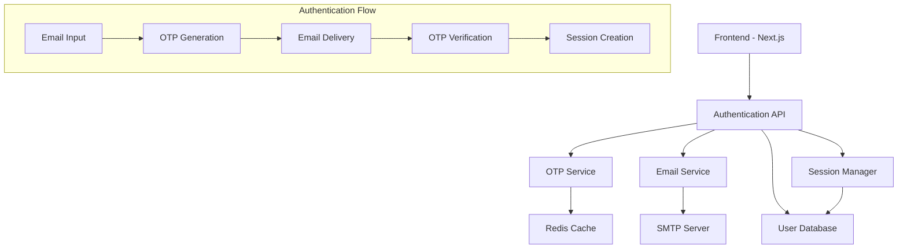

# Design Document

## Overview

The Email OTP Authentication System provides secure, passwordless authentication for the AstroSense space weather application. The system implements a session-based authentication flow where users authenticate using their email address and a one-time password (OTP) sent via email. Upon successful verification, the system creates a secure session that persists across browser sessions for 7 days.

The design integrates seamlessly with the existing FastAPI backend and Next.js frontend, adding authentication middleware to protect routes and maintain user context throughout the application.

## Architecture

### High-Level Architecture



### Component Architecture

The system consists of several key components:

1. **Authentication API**: FastAPI endpoints for login, verification, logout, and session validation
2. **OTP Service**: Generates, stores, and validates one-time passwords
3. **Email Service**: Handles email delivery using SMTP
4. **Session Manager**: Creates, validates, and manages user sessions
5. **Authentication Middleware**: Protects routes and provides user context
6. **Frontend Components**: Login forms and authentication state management

## Components and Interfaces

### Authentication API Endpoints

```python
# Authentication endpoints
POST /api/auth/login          # Initiate login with email
POST /api/auth/verify         # Verify OTP and create session
POST /api/auth/logout         # Invalidate session
GET  /api/auth/me            # Get current user info
POST /api/auth/refresh       # Refresh session
```

### OTP Service Interface

```python
class OTPService:
    def generate_otp(self, email: str) -> str
    def verify_otp(self, email: str, otp: str) -> bool
    def invalidate_otp(self, email: str) -> None
    def is_rate_limited(self, email: str) -> bool
```

### Email Service Interface

```python
class EmailService:
    def send_otp_email(self, email: str, otp: str) -> bool
    def validate_email_format(self, email: str) -> bool
```

### Session Manager Interface

```python
class SessionManager:
    def create_session(self, email: str) -> str
    def validate_session(self, token: str) -> Optional[str]
    def invalidate_session(self, token: str) -> None
    def cleanup_expired_sessions(self) -> int
```

## Data Models

### User Model

```python
class User(BaseModel):
    id: int
    email: str  # Encrypted in database
    created_at: datetime
    last_login: Optional[datetime]
    is_active: bool = True
```

### Session Model

```python
class Session(BaseModel):
    id: int
    user_id: int
    token: str  # Cryptographically secure random token
    created_at: datetime
    expires_at: datetime
    last_accessed: datetime
    is_active: bool = True
```

### OTP Model (Temporary Storage)

```python
class OTP(BaseModel):
    email: str
    otp_hash: str  # bcrypt hashed OTP
    created_at: datetime
    expires_at: datetime
    attempts: int = 0
```

### Database Schema

```sql
-- Users table
CREATE TABLE users (
    id SERIAL PRIMARY KEY,
    email_encrypted VARCHAR(255) UNIQUE NOT NULL,
    created_at TIMESTAMP DEFAULT CURRENT_TIMESTAMP,
    last_login TIMESTAMP,
    is_active BOOLEAN DEFAULT TRUE
);

-- Sessions table
CREATE TABLE sessions (
    id SERIAL PRIMARY KEY,
    user_id INTEGER REFERENCES users(id) ON DELETE CASCADE,
    token VARCHAR(255) UNIQUE NOT NULL,
    created_at TIMESTAMP DEFAULT CURRENT_TIMESTAMP,
    expires_at TIMESTAMP NOT NULL,
    last_accessed TIMESTAMP DEFAULT CURRENT_TIMESTAMP,
    is_active BOOLEAN DEFAULT TRUE
);

-- OTP temporary storage (Redis preferred, PostgreSQL fallback)
CREATE TABLE otps (
    email VARCHAR(255) PRIMARY KEY,
    otp_hash VARCHAR(255) NOT NULL,
    created_at TIMESTAMP DEFAULT CURRENT_TIMESTAMP,
    expires_at TIMESTAMP NOT NULL,
    attempts INTEGER DEFAULT 0
);

-- Indexes for performance
CREATE INDEX idx_sessions_token ON sessions(token);
CREATE INDEX idx_sessions_user_id ON sessions(user_id);
CREATE INDEX idx_sessions_expires_at ON sessions(expires_at);
CREATE INDEX idx_otps_expires_at ON otps(expires_at);
```

## Correctness Properties

*A property is a characteristic or behavior that should hold true across all valid executions of a system-essentially, a formal statement about what the system should do. Properties serve as the bridge between human-readable specifications and machine-verifiable correctness guarantees.*

### Property Reflection

After analyzing all acceptance criteria, I identified several areas where properties can be consolidated:

- Properties 1.1, 1.2, and 1.3 can be combined into a comprehensive OTP generation and delivery property
- Properties 2.1, 2.2, and 2.3 can be consolidated into a session lifecycle property
- Properties 3.1, 3.2, and 3.3 can be combined into a comprehensive security property
- Properties 4.1, 4.2, 4.3, 4.4, and 4.5 can be consolidated into UI feedback properties
- Properties 5.1, 5.2, 5.3, 5.4, and 5.5 can be combined into integration properties

### Core Properties

Property 1: OTP Generation and Validation
*For any* valid email address, generating an OTP should create a unique 6-digit code that expires after 5 minutes, and only the most recently generated OTP for that email should be valid
**Validates: Requirements 1.1, 1.4, 1.5**

Property 2: Email Delivery Timing
*For any* generated OTP, the email service should be called to send the code within 30 seconds of generation
**Validates: Requirements 1.2**

Property 3: Authentication Flow Completion
*For any* valid email and correct OTP combination entered within the expiration window, the system should create an authenticated session
**Validates: Requirements 1.3**

Property 4: Session Lifecycle Management
*For any* successfully created session, it should remain valid for exactly 7 days from creation and be invalidated immediately upon logout
**Validates: Requirements 2.1, 2.3, 2.4**

Property 5: Session Persistence
*For any* valid session token, the system should maintain authentication state across browser sessions until expiration
**Validates: Requirements 2.2, 2.5**

Property 6: Data Encryption Security
*For any* user email stored in the database, it should be encrypted using AES-256, and all session tokens should be cryptographically secure and unique
**Validates: Requirements 3.1, 3.2**

Property 7: OTP Storage Security
*For any* OTP stored in the system, it should be hashed using bcrypt before database storage
**Validates: Requirements 3.3**

Property 8: Rate Limiting Protection
*For any* email address with failed OTP verification attempts, the system should implement rate limiting after a threshold number of failures
**Validates: Requirements 3.4**

Property 9: Automatic Cleanup
*For any* expired sessions or OTPs, the system should automatically purge them from storage
**Validates: Requirements 3.5**

Property 10: Email Validation Feedback
*For any* invalid email format input, the system should display appropriate validation error messages
**Validates: Requirements 4.1**

Property 11: OTP Feedback Messages
*For any* successful OTP generation, the system should display confirmation with masked email, and for incorrect OTP entries, show remaining attempts
**Validates: Requirements 4.2, 4.3**

Property 12: Error Handling Feedback
*For any* expired OTP or email service failure, the system should provide appropriate error messages and retry options
**Validates: Requirements 4.4, 4.5**

Property 13: Route Protection
*For any* protected route accessed without valid authentication, the system should redirect to the login page
**Validates: Requirements 5.1**

Property 14: User Context Propagation
*For any* authenticated user, the system should provide user context to all application components and ensure existing endpoints respect authentication state
**Validates: Requirements 5.2, 5.3**

Property 15: Session Expiration Handling
*For any* session that expires during application use, the system should gracefully handle expiration and prompt for re-authentication
**Validates: Requirements 5.4, 5.5**

<function_calls>
<invoke name="prework">
<parameter name="featureName">email-otp-auth
##
 Error Handling

### OTP Generation Errors
- **Invalid Email Format**: Return 400 Bad Request with validation message
- **Rate Limiting**: Return 429 Too Many Requests with retry-after header
- **Email Service Failure**: Return 503 Service Unavailable with retry option

### OTP Verification Errors
- **Invalid OTP**: Return 401 Unauthorized with remaining attempts count
- **Expired OTP**: Return 410 Gone with option to request new code
- **Too Many Attempts**: Return 429 Too Many Requests with lockout period

### Session Management Errors
- **Invalid Session Token**: Return 401 Unauthorized and clear client-side token
- **Expired Session**: Return 401 Unauthorized and redirect to login
- **Session Creation Failure**: Return 500 Internal Server Error

### Database Errors
- **Connection Failure**: Implement retry logic with exponential backoff
- **Encryption/Decryption Errors**: Log securely and return generic error message
- **Constraint Violations**: Handle gracefully and return appropriate user message

## Testing Strategy

### Dual Testing Approach

The authentication system requires both unit testing and property-based testing to ensure comprehensive coverage:

**Unit Tests** verify specific examples, edge cases, and error conditions:
- Specific email format validation cases
- OTP generation with known inputs
- Session creation and validation scenarios
- Error handling for specific failure modes
- Integration points between components

**Property-Based Tests** verify universal properties across all inputs:
- OTP generation produces valid codes for any email
- Session tokens are always cryptographically secure
- Rate limiting works for any sequence of requests
- Encryption/decryption is consistent for any email
- Authentication flow works for any valid input combination

### Property-Based Testing Framework

The system will use **Hypothesis** for Python property-based testing, configured to run a minimum of 100 iterations per property test. Each property-based test will be tagged with comments explicitly referencing the correctness property from this design document using the format: **Feature: email-otp-auth, Property {number}: {property_text}**

### Test Coverage Requirements

- **Unit Tests**: Cover specific examples, edge cases, and integration points
- **Property Tests**: Verify all 15 correctness properties defined above
- **Integration Tests**: Test complete authentication flows end-to-end
- **Security Tests**: Verify encryption, hashing, and rate limiting
- **Performance Tests**: Ensure OTP generation and session validation meet timing requirements

### Mock Strategy

- **Email Service**: Mock SMTP calls to test delivery logic without sending real emails
- **Time**: Mock datetime functions to test expiration logic
- **Database**: Use test database with rollback transactions
- **Encryption**: Test with known keys to verify encryption/decryption

## Security Considerations

### Data Protection
- **Email Encryption**: AES-256 encryption for email addresses in database
- **OTP Hashing**: bcrypt with salt for temporary OTP storage
- **Session Tokens**: Cryptographically secure random generation (256-bit)
- **Database Security**: Encrypted connections and parameterized queries

### Attack Prevention
- **Rate Limiting**: Prevent brute force OTP attacks (5 attempts per 15 minutes)
- **Timing Attacks**: Constant-time comparison for OTP verification
- **Session Fixation**: Generate new tokens on each authentication
- **CSRF Protection**: SameSite cookies and CSRF tokens for session cookies

### Compliance
- **Data Retention**: Automatic cleanup of expired sessions and OTPs
- **Audit Logging**: Log authentication events without sensitive data
- **Privacy**: Minimal data collection (email only)
- **Encryption Standards**: Use industry-standard algorithms and key sizes

## Integration Points

### Frontend Integration
- **Authentication Context**: React context provider for auth state
- **Route Protection**: Higher-order component for protected routes
- **Session Management**: Automatic token refresh and logout handling
- **Error Handling**: User-friendly error messages and retry flows

### Backend Integration
- **Middleware**: FastAPI dependency for route protection
- **Database**: Extend existing PostgreSQL schema with auth tables
- **Email Service**: SMTP configuration for OTP delivery
- **Session Storage**: Database-backed session management

### Existing System Integration
- **API Endpoints**: Add authentication middleware to existing routes
- **User Context**: Provide authenticated user info to existing services
- **Database Migration**: Add auth tables to existing schema
- **Configuration**: Environment variables for email and encryption settings

## Performance Considerations

### Response Times
- **OTP Generation**: < 100ms for code generation and storage
- **Email Delivery**: < 30 seconds for SMTP delivery
- **Session Validation**: < 50ms for token verification
- **Database Operations**: < 200ms for auth-related queries

### Scalability
- **Session Storage**: Database-backed with indexed lookups
- **OTP Storage**: Redis preferred for temporary storage, PostgreSQL fallback
- **Rate Limiting**: In-memory storage with periodic cleanup
- **Connection Pooling**: Reuse existing database connection pool

### Caching Strategy
- **Session Validation**: Cache valid sessions in memory for 5 minutes
- **User Data**: Cache decrypted user info for session duration
- **Rate Limit Counters**: In-memory storage with TTL
- **Email Templates**: Cache rendered templates for OTP emails